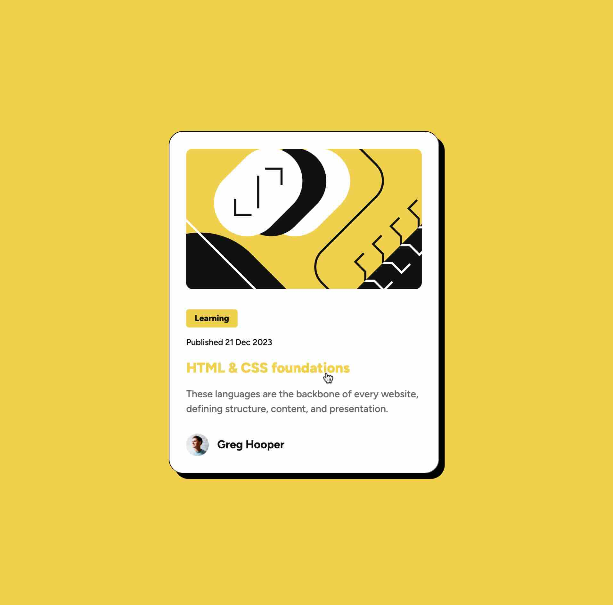

# Frontend Mentor - Blog preview card solution

This is a solution to the [Blog preview card challenge on Frontend Mentor](https://www.frontendmentor.io/challenges/blog-preview-card-ckPaj01IcS).

## Table of contents

- [Overview](#overview)
  - [The challenge](#the-challenge)
  - [Screenshot](#screenshot)
  - [Links](#links)
- [My process](#my-process)
  - [Built with](#built-with)
  - [What I learned](#what-i-learned)
  - [Continued development](#continued-development)
- [Author](#author)

## Overview

### The challenge

Users should be able to:

- See hover and focus states for all interactive elements on the page

### Screenshot



### Links

- Solution URL: [Source Code on GitHub](https://github.com/ikokolius/blog-preview-card)
- Live Site URL: [Blog Preview Card](https://ikokolius.github.io/blog-preview-card)

## My process

### Built with

- Semantic HTML5 markup
- CSS custom properties
- Flexbox
- Mobile-first workflow

### What I learned

I learned that it is best to set line-height using number, not percentages:

```css
.line-height: 1.5;
.line-height: 150%; /* gives unpredictable results due to rounding */
```

### Continued development

I haven't still figured out how to set different font sizes for desktop and mobile versions withour media queries

## Author

- LinkedIn - [Iryna Kokolius](https://linkedin.com/in/iryna-kokolius)
- Frontend Mentor - [Iryna Kokolius](https://www.frontendmentor.io/profile/ikokolius)
